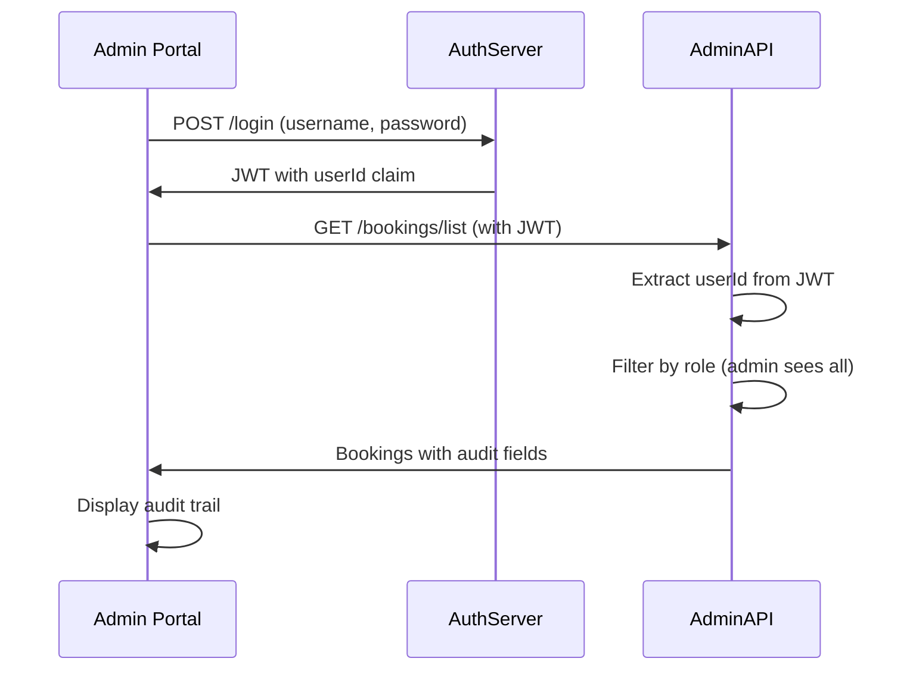

# Phase 1 - Complete Platform Summary

**Initiative:** User-Specific Data Access Enforcement  
**Date:** January 11, 2026  
**Status:** AuthServer ? | AdminAPI ? | Admin Portal ?? (Reference Available)

---

## ?? Phase 1 Overview

**Goal:** Introduce ownership tracking and basic access filtering across the Bellwood platform without adding new roles yet.

**Completed:**
- ? **AuthServer:** Added `userId` claim to JWTs
- ? **AdminAPI:** Added ownership fields and role-based filtering
- ?? **Admin Portal:** Ready for integration work

---

## ?? AuthServer Changes (Complete)

### What Changed:
- All JWTs now include `userId` claim (always Identity GUID)
- Dual UID format preserved (GUID for most users, custom for drivers)
- Phase 2 dispatcher role prepared but not activated

### JWT Structure (Phase 1):

**Regular User:**
```json
{
  "sub": "alice",
  "uid": "a1b2c3d4-...",
  "userId": "a1b2c3d4-...",  // ? NEW
  "role": "admin"
}
```

**Driver:**
```json
{
  "sub": "charlie",
  "uid": "driver-001",        // Custom for assignment
  "userId": "x9y8z7w6-...",   // ? NEW (Identity GUID)
  "role": "driver"
}
```

### Documentation:
- Implementation: `Docs/AuthServer-Phase1_Implementation.md`
- Testing: `Docs/AuthServer-Phase1_Testing.md`
- Quick Reference: `Docs/Phase1-QuickReference.md`

---

## ?? AdminAPI Changes (Complete)

### What Changed:
1. **New Fields on Records:**
   - `CreatedByUserId` - Who created the record (from JWT `userId`)
   - `ModifiedByUserId` - Who last modified the record
   - `ModifiedOnUtc` - When last modified

2. **Role-Based Filtering:**
   - **Admins:** See all records
   - **Bookers:** See only records they created
   - **Drivers:** See only assigned bookings

3. **Ownership Verification:**
   - Detail endpoints verify user has access (403 if not)
   - Cancel endpoint verifies ownership before allowing
   - Legacy records (null `createdByUserId`) visible to admins only

### Example API Response (Phase 1):
```json
{
  "bookingId": "BK-123",
  "passengerName": "John Doe",
  "status": "Confirmed",
  "createdUtc": "2026-01-10T10:00:00Z",
  "createdByUserId": "a1b2c3d4-...",      // ? NEW
  "modifiedByUserId": "x9y8z7w6-...",     // ? NEW
  "modifiedOnUtc": "2026-01-10T15:30:00Z" // ? NEW
}
```

### Authorization Rules:

| Endpoint | Admin | Booker | Driver |
|----------|-------|--------|--------|
| `GET /bookings/list` | All records | Own only | Assigned only |
| `GET /bookings/{id}` | Any booking | Own only | Assigned only |
| `POST /bookings/{id}/cancel` | Any booking | Own only | ? Forbidden |
| `GET /quotes/list` | All quotes | Own only | N/A |
| `GET /quotes/{id}` | Any quote | Own only | N/A |

### Documentation:
- Implementation: `Docs/API-Phase1_Data_Access_Implementation.md`

---

## ?? Admin Portal Changes (Reference)

### What the Portal Team Needs to Know:

The Portal will receive updated API responses from AdminAPI with new audit fields. The changes are backward compatible.

#### API Response Changes:
```json
{
  "bookingId": "BK-123",
  "passengerName": "John Doe",
  "status": "Confirmed",
  "createdUtc": "2026-01-10T10:00:00Z",
  "createdByUserId": "a1b2c3d4-...",      // ? NEW
  "modifiedByUserId": "x9y8z7w6-...",     // ? NEW
  "modifiedOnUtc": "2026-01-10T15:30:00Z" // ? NEW
}
```

#### Key Points for Portal:
1. **JWT Handling:** No changes required (backward compatible)
2. **API Responses:** Now include three additional audit fields
3. **Filtering:** AdminAPI filters data automatically by user role
4. **403 Errors:** AdminAPI may return 403 Forbidden for unauthorized access
5. **Legacy Data:** Records created before Phase 1 have null audit fields

#### Reference Documentation:
- `Docs/AdminPortal-Phase1_Implementation.md` - Backend changes reference (informational)

**Note:** Implementation guidance for the Admin Portal will be provided separately by the project lead.

---

## ?? Integration Flow (Phase 1)



---

## ?? Implementation Checklist

### AuthServer (Complete ?)
- [x] Add `userId` claim to all token endpoints
- [x] Preserve dual UID format
- [x] Prepare Phase 2 dispatcher role
- [x] Update documentation
- [x] Build successful

### AdminAPI (Complete ?)
- [x] Add `CreatedByUserId`, `ModifiedByUserId`, `ModifiedOnUtc` fields
- [x] Implement ownership capture on create
- [x] Implement role-based filtering on list endpoints
- [x] Implement ownership verification on detail/mutation endpoints
- [x] Create `UserAuthorizationHelper`
- [x] Update documentation

### Admin Portal (To Do ??)
- [ ] Update booking/quote models with audit fields
- [ ] Display audit trail on detail pages
- [ ] Handle 403 Forbidden responses
- [ ] Test with admin user viewing all records
- [ ] Test with admin user viewing legacy records
- [ ] Integration testing with AdminAPI

---

## ?? End-to-End Testing Scenario

### Test: Admin Creates and Views Booking

**Step 1: Login to Portal**
```
User: alice
Password: password
```

**Step 2: Portal Gets JWT from AuthServer**
```json
{
  "sub": "alice",
  "uid": "a1b2c3d4-e5f6-7890-abcd-ef1234567890",
  "userId": "a1b2c3d4-e5f6-7890-abcd-ef1234567890",
  "role": "admin"
}
```

**Step 3: Portal Creates Booking via AdminAPI**
```http
POST /bookings
Authorization: Bearer eyJ...
{
  "passengerName": "John Doe",
  "pickup": "123 Main St"
}
```

**Step 4: AdminAPI Captures Ownership**
```csharp
booking.CreatedByUserId = "a1b2c3d4-e5f6-7890-abcd-ef1234567890"; // From JWT userId claim
booking.CreatedUtc = DateTime.UtcNow;
```

**Step 5: Portal Views Booking List**
```http
GET /bookings/list
Authorization: Bearer eyJ...
```

**Step 6: AdminAPI Returns Bookings with Audit Data**
```json
[
  {
    "bookingId": "BK-123",
    "passengerName": "John Doe",
    "createdUtc": "2026-01-11T10:00:00Z",
    "createdByUserId": "a1b2c3d4-e5f6-7890-abcd-ef1234567890"
  }
]
```

**Step 7: Portal Displays Audit Trail**
```
Booking BK-123
Created: Jan 11, 2026 10:00 AM
Created By: a1b2c3d4-e5f6-7890-abcd-ef1234567890
```

? **Expected Result:** Booking created and audit trail displayed correctly

---

## ?? Key Integration Points

### 1. JWT Token Flow
- **AuthServer** issues JWT with `userId` claim
- **Admin Portal** includes JWT in API requests
- **AdminAPI** extracts `userId` for ownership tracking

### 2. Audit Field Usage
- **AdminAPI** populates `createdByUserId` on record creation
- **AdminAPI** returns audit fields in responses
- **Admin Portal** displays audit trail to users

### 3. Authorization Flow
- **AdminAPI** filters data based on user role
- **AdminAPI** returns 403 for unauthorized access
- **Admin Portal** handles 403 errors gracefully

---

## ?? Phase 2 Preview

**Coming Soon (Not in Phase 1):**
- Dispatcher role activation
- Authorization policies (AdminOnly, StaffOnly)
- Role-based UI hiding in portal
- Field masking for sensitive data

**Phase 1 Focus:**
- Ownership tracking ?
- Basic access filtering ?
- Audit trail display ??

---

## ?? Test User Reference

| Username | Password | Role | Access Level | Phase 1 Ready |
|----------|----------|------|--------------|---------------|
| alice | password | admin | All records | ? |
| bob | password | admin | All records | ? |
| chris | password | booker | Own only | ? |
| charlie | password | driver | Assigned only | ? |
| diana | password | dispatcher | Phase 2 only | ?? |

---

## ?? Complete Documentation Index

### AuthServer
- `Docs/AuthServer-Phase1_Implementation.md` - Full implementation details
- `Docs/AuthServer-Phase1_Testing.md` - Test scenarios
- `Docs/AuthServer-Phase1_Complete.md` - Completion summary
- `Docs/Phase1-QuickReference.md` - Quick developer reference

### AdminAPI
- `Docs/API-Phase1_Data_Access_Implementation.md` - Implementation summary

### Admin Portal
- `Docs/AdminPortal-Phase1_Implementation.md` - Implementation guide

### Planning
- `Docs/Planning-DataAccessEnforcement.md` - Overall platform strategy

---

## ? Phase 1 Success Criteria

**Phase 1 is complete when:**
- [x] AuthServer issues `userId` claim in all JWTs
- [x] AdminAPI captures ownership on record creation
- [x] AdminAPI filters data by user role
- [x] AdminAPI verifies ownership on mutations
- [ ] Admin Portal displays audit trail
- [ ] Admin Portal handles 403 errors
- [ ] Integration testing successful
- [ ] All three components working together

---

## ?? Next Steps

### For Admin Portal Team:
1. Read `Docs/AdminPortal-Phase1_Implementation.md`
2. Update models to include audit fields
3. Add audit trail UI components
4. Implement 403 error handling
5. Test integration with AdminAPI
6. Report completion

### For Testing Team:
1. Execute AuthServer tests (`Docs/AuthServer-Phase1_Testing.md`)
2. Execute AdminAPI integration tests
3. Execute end-to-end scenario (this document)
4. Validate audit trail display in portal
5. Sign off on Phase 1

### For Project Lead:
1. Review all Phase 1 documentation
2. Approve Portal implementation plan
3. Schedule Phase 2 planning session
4. Coordinate Phase 2 kickoff

---

**Status:** AuthServer ? | AdminAPI ? | Admin Portal ?? (Reference Available)  
**Target Completion:** Pending Portal Implementation Guidance  
**Priority:** ?? **CRITICAL - BLOCKS ALPHA TESTING**

---

*Phase 1 establishes the foundation for data access enforcement. AuthServer and AdminAPI are complete. Admin Portal has reference documentation available and awaits implementation guidance from project lead.* ???
