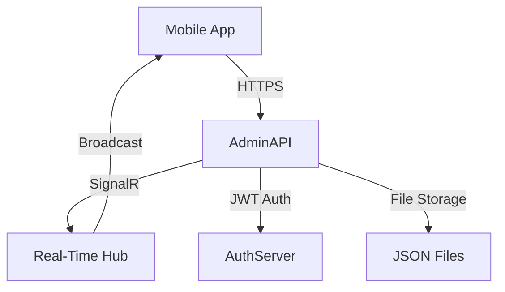

# Bellwood Documentation Standard v2.0

**Document Type**: Standards & Guidelines  
**Last Updated**: January 17, 2026  
**Status**: ✅ Official Standard  
**Applies To**: All Bellwood System Components

---

## 📋 Executive Summary

This document defines the **official documentation standard** for all Bellwood system components. Following this guide ensures consistent, professional, and maintainable documentation across the entire platform.

**Purpose**: Enable any team to create world-class documentation libraries that match the quality and structure established in the AdminAPI documentation.

**Target Audience**: Development teams, technical writers, project leads

**Expected Outcome**: Complete, professional documentation library ready for production use

---

## 🎯 Documentation Philosophy

### Core Principles

1. **Living Documents**: Documentation evolves with the code
2. **Practical Over Academic**: Real examples trump theory
3. **User-Centric**: Written for the reader, not the writer
4. **Cross-Referenced**: Connected, not siloed
5. **Production-Ready**: Deployment-focused, not just development-focused

### Quality Standards

- ✅ **Completeness**: Every feature documented
- ✅ **Accuracy**: Verified against actual code
- ✅ **Clarity**: No jargon without explanation
- ✅ **Timeliness**: Updated with code changes
- ✅ **Accessibility**: Easy to find, easy to understand

---

## 📚 Documentation Library Structure

### The 4-Series System

Every Bellwood component follows this proven structure:

```
Docs/
├── 00-09 Series: Project Overview
│   ├── 00-README.md                    # Quick start & feature overview
│   ├── 01-System-Architecture.md       # Technical architecture
│   └── 02-Testing-Guide.md             # Testing strategies
│
├── 10-19 Series: Feature Documentation
│   ├── 10-[Feature-Name].md            # Primary feature
│   ├── 11-[Feature-Name].md            # Secondary feature
│   ├── 12-[Feature-Name].md            # Tertiary feature
│   └── ...                             # Additional features
│
├── 20-29 Series: Technical References
│   ├── 20-API-Reference.md             # Endpoint documentation
│   ├── 21-SignalR-Events.md (optional) # Real-time events
│   ├── 22-Data-Models.md               # Entity schemas
│   └── 23-Security-Model.md            # Auth & authorization
│
└── 30-39 Series: Deployment & Operations
    ├── 30-Deployment-Guide.md          # Build & deploy
    ├── 31-Scripts-Reference.md         # Automation scripts
    └── 32-Troubleshooting.md           # Common issues & solutions
```

### Numbering Convention

| Series | Range | Purpose | Examples |
|--------|-------|---------|----------|
| **00-09** | 00-09 | High-level overview | README, Architecture, Testing |
| **10-19** | 10-19 | Feature deep-dives | Real-Time Tracking, User Access Control |
| **20-29** | 20-29 | Technical references | API Reference, Data Models, Security |
| **30-39** | 30-39 | Operations | Deployment, Scripts, Troubleshooting |

**Advantages**:
- ✅ Alphabetical sorting works naturally
- ✅ Easy to add new docs (use next available number)
- ✅ Clear categorization at a glance
- ✅ Scalable (room for growth in each series)

---

## 📝 Document Template

### Standard Document Header

Every document must include this header:

```markdown
# [Document Title]

**Document Type**: [Living Document | Standards | Reference]  
**Last Updated**: [Date]  
**Status**: [Draft | In Review | Production Ready]

---

## 📋 Overview

[Brief description of document purpose and scope]

**Target Audience**: [Who should read this]  
**Prerequisites**: [What reader should know first]

---
```

**Example**:

```markdown
# Real-Time GPS Tracking

**Document Type**: Living Document - Feature Documentation  
**Last Updated**: January 14, 2026  
**Status**: ✅ Production Ready

---

## 📋 Overview

This document describes the real-time GPS tracking system for driver location monitoring, including WebSocket communication, location storage, and client integration.

**Target Audience**: Backend developers, mobile developers, DevOps  
**Prerequisites**: Understanding of SignalR, JWT authentication, REST APIs

---
```

---

## 🗂️ Required Documents

### Minimum Viable Documentation Library

Every component **must** include these 8 core documents:

| # | Document | Purpose | Priority |
|---|----------|---------|----------|
| 1 | `00-README.md` | Quick start, features, getting started | 🔴 Critical |
| 2 | `01-System-Architecture.md` | Design, components, data flow | 🔴 Critical |
| 3 | `02-Testing-Guide.md` | Test strategies, running tests | 🟡 Important |
| 4 | `10-[Primary-Feature].md` | Main feature documentation | 🔴 Critical |
| 5 | `20-API-Reference.md` | Endpoint documentation | 🔴 Critical |
| 6 | `22-Data-Models.md` | Entity schemas, DTOs | 🟡 Important |
| 7 | `23-Security-Model.md` | Auth, authorization, security | 🔴 Critical |
| 8 | `30-Deployment-Guide.md` | Build, publish, deploy | 🔴 Critical |

**Additional Documents** (add as needed):
- `11-19`: One doc per major feature
- `21-SignalR-Events.md`: If using real-time communication
- `31-Scripts-Reference.md`: If automation scripts exist
- `32-Troubleshooting.md`: Strongly recommended for all components

---

## ✍️ Writing Guidelines

### Style Guide

**Tone**: Professional yet approachable

```markdown
✅ Good: "This endpoint requires authentication. Pass your JWT token in the Authorization header."

❌ Bad: "You must authenticate. Authorization header required."

✅ Good: "The system uses rate limiting to prevent server overload. Location updates are limited to one per 10 seconds."

❌ Bad: "Rate limiting prevents spam. 10s minimum."
```

**Formatting**:
- Use **bold** for emphasis
- Use `code` for technical terms, commands, filenames
- Use > blockquotes for important notes
- Use ✅ ❌ 🔴 🟡 emojis sparingly for visual scanning

**Headers**:
- `#` (H1): Document title only
- `##` (H2): Major sections
- `###` (H3): Sub-sections
- `####` (H4): Rare, only for deep nesting

### Code Examples

**Always include**:
- ✅ Language identifier in code blocks
- ✅ Comments explaining key lines
- ✅ Real, working examples (not pseudocode)
- ✅ Expected output where applicable

**Example**:

````markdown
```csharp
// Configure JWT authentication
builder.Services.AddAuthentication(options =>
{
    options.DefaultAuthenticateScheme = JwtBearerDefaults.AuthenticationScheme;
})
.AddJwtBearer(options =>
{
    options.MapInboundClaims = false;  // ✅ Critical: Prevents claim remapping
    options.TokenValidationParameters = new TokenValidationParameters
    {
        ValidateIssuer = false,
        ValidateAudience = false,
        IssuerSigningKey = signingKey,
        RoleClaimType = "role",  // Map "role" claim to roles
    };
});
```

**Output**:
```
✅ Authentication configured successfully
   Scheme: Bearer
   RoleClaimType: role
```
````

---

## 🎨 Visual Elements

### Diagrams

**Required Diagrams**:

1. **System Architecture Diagram** (`01-System-Architecture.md`)
   - Components and their relationships
   - Data flow
   - External dependencies

2. **Data Model Diagram** (`22-Data-Models.md`)
   - Entity relationships
   - Key fields
   - Foreign keys

**Recommended Tools**:
- Mermaid (inline in Markdown)
- PlantUML
- Draw.io
- Excalidraw

**Example (Mermaid)**:

````markdown

````

### Tables

**Use tables for**:
- Endpoint listings
- Parameter documentation
- Status code mappings
- Configuration options

**Example**:

```markdown
| Endpoint | Method | Auth | Description |
|----------|--------|------|-------------|
| `/quotes` | POST | Required | Submit quote request |
| `/quotes/list` | GET | StaffOnly | List all quotes |
| `/quotes/{id}` | GET | StaffOnly | Get quote by ID |
```

---

## 🔗 Cross-Referencing

### Internal Links

**Always link to related documentation**:

```markdown
## Related Documentation

- `01-System-Architecture.md` - Overall system design
- `10-Real-Time-Tracking.md` - GPS tracking implementation
- `23-Security-Model.md` - Authentication details
```

**Deep Links** (to specific sections):

```markdown
See [JWT Authentication](23-Security-Model.md#jwt-authentication) for token format details.
```

### External Links

**Format**:

```markdown
- **.NET 8.0 SDK**: [Download](https://dotnet.microsoft.com/download)
- **SignalR Documentation**: [Microsoft Docs](https://docs.microsoft.com/aspnet/core/signalr/)
```

---

## 📊 Content Guidelines

### 00-README.md

**Purpose**: Entry point to documentation library

**Required Sections**:
1. **Overview**: What is this component?
2. **Features**: Bullet list of capabilities
3. **Quick Start**: Get running in 5 minutes
4. **Documentation Index**: Links to all docs
5. **Contributing**: How to update docs

**Template**:

```markdown
# [Component Name]

**Type**: [API | Service | Library | Application]  
**Framework**: .NET 8.0  
**Status**: Production Ready

---

## 📋 Overview

[2-3 sentence description]

## ✨ Features

- ✅ Feature 1
- ✅ Feature 2
- ✅ Feature 3

## 🚀 Quick Start

### Prerequisites
- .NET 8.0 SDK
- [Other requirements]

### Run Locally
```bash
dotnet run
```

## 📚 Documentation

| Document | Description |
|----------|-------------|
| [System Architecture](01-System-Architecture.md) | Technical design |
| [API Reference](20-API-Reference.md) | Endpoint documentation |
| [Deployment Guide](30-Deployment-Guide.md) | Production deployment |

## 🤝 Contributing

See [CONTRIBUTING.md](CONTRIBUTING.md) for documentation guidelines.

---

**Last Updated**: [Date]  
**Version**: [Semantic Version]
```

---

### 01-System-Architecture.md

**Purpose**: Technical architecture and design decisions

**Required Sections**:
1. **System Overview**: High-level description
2. **Components**: Major building blocks
3. **Data Flow**: Request/response flow diagrams
4. **Technology Stack**: Languages, frameworks, libraries
5. **Design Decisions**: Why we chose X over Y
6. **Integration Points**: How it connects to other components

**Template Outline**:

```markdown
# System Architecture

## 📋 Overview
[What this component does]

## 🏗️ Components
### Component 1
[Description, responsibilities]

### Component 2
[Description, responsibilities]

## 🔄 Data Flow
[Diagrams showing request/response flow]

## 🛠️ Technology Stack
| Technology | Purpose | Version |
|------------|---------|---------|
| .NET | Runtime | 8.0 |

## 🧠 Design Decisions
### Decision 1: [Choice Made]
**Problem**: [What we needed to solve]  
**Options Considered**: [Alternatives]  
**Decision**: [What we chose]  
**Rationale**: [Why we chose it]

## 🔌 Integration Points
[How this connects to other components]

## 📚 Related Documentation
- [Link to related docs]
```

---

### 02-Testing-Guide.md

**Purpose**: How to test the component

**Required Sections**:
1. **Testing Strategy**: Unit, integration, E2E
2. **Running Tests**: Commands and scripts
3. **Test Data**: How to seed/mock data
4. **CI/CD Integration**: Automated testing
5. **Manual Test Scenarios**: Step-by-step tests

**Key Content**:

```markdown
# Testing Guide

## 📋 Overview
[Testing philosophy and approach]

## 🧪 Test Types

### Unit Tests
**Location**: `Tests/UnitTests/`  
**Framework**: xUnit  
**Run Command**:
```bash
dotnet test --filter Category=Unit
```

### Integration Tests
**Location**: `Tests/IntegrationTests/`  
**Prerequisites**: [Database, APIs running]  
**Run Command**:
```bash
dotnet test --filter Category=Integration
```

## 🎯 Test Scenarios

### Scenario 1: [Feature Name]
**Steps**:
1. [Action]
2. [Action]
3. [Verification]

**Expected Result**: [What should happen]

## 📊 Test Coverage

| Component | Coverage | Status |
|-----------|----------|--------|
| Controllers | 85% | ✅ |
| Services | 92% | ✅ |
| Models | 100% | ✅ |

## 🔧 Troubleshooting Tests

### Issue 1: [Common test failure]
**Cause**: [Why it happens]  
**Fix**: [How to resolve]
```

---

### 10-19 Series: Feature Documentation

**Purpose**: Deep-dive into individual features

**One Document Per Major Feature**:
- 10-[Primary-Feature].md
- 11-[Secondary-Feature].md
- 12-[Third-Feature].md
- etc.

**Template**:

```markdown
# [Feature Name]

**Document Type**: Living Document - Feature Documentation  
**Last Updated**: [Date]  
**Status**: [Draft | Production Ready]

---

## 📋 Overview

[What this feature does and why it exists]

**Use Cases**:
- Use case 1
- Use case 2

## 🎯 User Stories

**As a [role], I want to [action] so that [benefit]**

Example:
- As a driver, I want to send GPS updates so passengers can track my location

## 🏗️ Implementation

### Architecture
[Diagram showing how feature is implemented]

### Key Components
- **Component 1**: [Responsibility]
- **Component 2**: [Responsibility]

## 🔧 Configuration

[Required settings, environment variables]

```json
{
  "FeatureName": {
    "Setting1": "value",
    "Setting2": "value"
  }
}
```

## 📚 API Endpoints

| Endpoint | Method | Auth | Description |
|----------|--------|------|-------------|
| `/feature` | GET | Required | Get feature data |
| `/feature` | POST | AdminOnly | Create feature |

## 💡 Usage Examples

### Example 1: [Scenario]

**Request**:
```bash
curl -X GET https://api.example.com/feature \
  -H "Authorization: Bearer $token"
```

**Response**:
```json
{
  "data": "example"
}
```

## 🐛 Troubleshooting

### Issue 1: [Common problem]
**Symptom**: [What user sees]  
**Cause**: [Root cause]  
**Fix**: [Solution]

## 🔮 Future Enhancements

- [ ] Enhancement 1
- [ ] Enhancement 2

## 📚 Related Documentation

- [Related doc 1]
- [Related doc 2]
```

---

### 20-API-Reference.md

**Purpose**: Complete endpoint documentation

**Required Content**:
- All endpoints listed
- Request/response examples
- Authentication requirements
- Error codes

**Template**:

```markdown
# API Reference

**Document Type**: Living Document - Technical Reference  
**Last Updated**: [Date]  
**Status**: Production Ready

---

## 📋 Overview

**Base URL**: `https://api.example.com`  
**Authentication**: Bearer JWT tokens

## 🔐 Authentication

All endpoints require JWT token:

```http
Authorization: Bearer {jwt_token}
```

## 📚 Endpoints

### [Feature] Endpoints

#### GET /resource

**Description**: [What this does]

**Auth**: [Required | AdminOnly | StaffOnly]

**Request**:
```http
GET /resource HTTP/1.1
Host: api.example.com
Authorization: Bearer {token}
```

**Response** (200 OK):
```json
{
  "id": "123",
  "name": "example"
}
```

**Error Responses**:
- **401 Unauthorized**: Missing or invalid token
- **403 Forbidden**: Insufficient permissions
- **404 Not Found**: Resource not found

#### POST /resource

[Similar format for each endpoint]

## 📊 HTTP Status Codes

| Code | Meaning | Common Causes |
|------|---------|---------------|
| 200 | Success | Request processed |
| 401 | Unauthorized | Missing token |
| 403 | Forbidden | Insufficient permissions |

## 🧪 Testing with cURL

[Examples of common cURL commands]

## 📚 Related Documentation

- [Security Model](23-Security-Model.md)
- [Data Models](22-Data-Models.md)
```

---

### 22-Data-Models.md

**Purpose**: Entity schemas and relationships

**Required Content**:
- All entities documented
- Field descriptions
- Relationships mapped
- DTO specifications

**Template**:

```markdown
# Data Models & Entities

**Document Type**: Living Document - Technical Reference  
**Last Updated**: [Date]  
**Status**: Production Ready

---

## 📋 Overview

This document describes all data entities and DTOs.

**Storage**: [Database type | File-based | In-memory]

---

## 🗂️ Core Entities

### EntityName

**File**: `Models/EntityName.cs`  
**Storage**: [Where it's persisted]

**Purpose**: [What this entity represents]

```csharp
public sealed class EntityName
{
    public string Id { get; set; }              // Auto-generated GUID
    public DateTime CreatedUtc { get; set; }    // Creation timestamp
    public string Name { get; set; }            // Display name
}
```

**Field Descriptions**:

| Field | Type | Required | Description |
|-------|------|----------|-------------|
| `Id` | string | Yes | Unique identifier (GUID) |
| `CreatedUtc` | DateTime | Yes | When created (UTC) |
| `Name` | string | Yes | Display name |

**Relationships**:
- → `RelatedEntity` (via `RelatedEntityId`)

---

## 📤 Response DTOs

### EntityResponseDto

**Purpose**: [When this DTO is used]

```csharp
public sealed class EntityResponseDto
{
    public string Id { get; set; }
    public string Name { get; set; }
}
```

---

## 🗄️ Data Relationships

[Entity Relationship Diagram]

```
┌─────────────┐
│   Entity1   │
└──────┬──────┘
       │ 1:N
       ↓
┌─────────────┐
│   Entity2   │
└─────────────┘
```

## 📚 Related Documentation

- [API Reference](20-API-Reference.md)
- [System Architecture](01-System-Architecture.md)
```

---

### 23-Security-Model.md

**Purpose**: Authentication, authorization, and security

**Required Content**:
- Authentication method
- Authorization policies
- Security best practices
- Common vulnerabilities addressed

**Template**:

```markdown
# Security Model & Authorization

**Document Type**: Living Document - Technical Reference  
**Last Updated**: [Date]  
**Status**: Production Ready

---

## 📋 Overview

[Security approach and strategy]

**Authentication Method**: [JWT | OAuth2 | API Keys]  
**Authorization Strategy**: [RBAC | ABAC | Custom]

---

## 🔐 Authentication

### JWT Token Format

**Header**:
```json
{
  "alg": "HS256",
  "typ": "JWT"
}
```

**Payload**:
```json
{
  "sub": "username",
  "role": "admin",
  "exp": 1735050000
}
```

### Required Claims

| Claim | Type | Description |
|-------|------|-------------|
| `sub` | string | Username |
| `role` | string | User role |
| `exp` | int | Expiration timestamp |

---

## 👥 User Roles

### Role Hierarchy

```
admin
  ├─ Full system access
  └─ Manage users

user
  ├─ Basic access
  └─ Own data only
```

---

## 🛡️ Authorization Policies

### Policy Definitions

```csharp
builder.Services.AddAuthorization(options =>
{
    options.AddPolicy("AdminOnly", policy =>
        policy.RequireRole("admin"));
});
```

### Policy Matrix

| Policy | Roles | Use Cases |
|--------|-------|-----------|
| AdminOnly | admin | Sensitive operations |
| UserOnly | user | Standard access |

---

## 🔒 Security Best Practices

1. **Always use HTTPS** in production
2. **Rotate secrets** regularly
3. **Validate input** on all endpoints
4. **Rate limit** API calls

---

## 🚨 Common Security Pitfalls

### ❌ Pitfall 1: [Issue]
**Problem**: [Description]  
**Fix**: [Solution]

---

## 📚 Related Documentation

- [API Reference](20-API-Reference.md)
- [Deployment Guide](30-Deployment-Guide.md)
```

---

### 30-Deployment-Guide.md

**Purpose**: Build, publish, and deploy instructions

**Required Content**:
- Prerequisites
- Local setup
- Build process
- Deployment steps (all environments)
- Configuration

**Template**:

```markdown
# Deployment Guide

**Document Type**: Living Document - Deployment & Operations  
**Last Updated**: [Date]  
**Status**: Production Ready

---

## 📋 Overview

[Deployment strategy and supported environments]

**Target Framework**: .NET 8.0  
**Deployment Models**: [IIS | Azure | Docker | Kubernetes]

---

## 🏗️ Prerequisites

### Development Environment

**Required Software**:
- ✅ .NET 8.0 SDK ([Download](https://dotnet.microsoft.com/download))
- ✅ [Other requirements]

**Verification**:
```bash
dotnet --version
# Expected: 8.0.x or higher
```

---

## 🛠️ Local Development Setup

### Step 1: Clone Repository

```bash
git clone [repository-url]
cd [project-directory]
```

### Step 2: Restore Dependencies

```bash
dotnet restore
```

### Step 3: Configure Settings

**File**: `appsettings.Development.json`

```json
{
  "Setting1": "value1",
  "Setting2": "value2"
}
```

### Step 4: Build & Run

```bash
dotnet build
dotnet run
```

**Verify**:
```bash
curl https://localhost:5000/health
# Expected: {"status":"ok"}
```

---

## 📦 Build for Production

### Release Build

```bash
dotnet clean
dotnet build --configuration Release
```

### Publish

```bash
dotnet publish --configuration Release --runtime win-x64 --self-contained true -o ./publish
```

---

## 🌍 Environment Configuration

### Environment Variables

**Required**:

| Variable | Description | Example |
|----------|-------------|---------|
| `ASPNETCORE_ENVIRONMENT` | Environment name | `Production` |
| `Setting1` | [Description] | [Example] |

**Windows**:
```powershell
$env:ASPNETCORE_ENVIRONMENT = "Production"
```

**Linux**:
```bash
export ASPNETCORE_ENVIRONMENT=Production
```

---

## 🖥️ IIS Deployment

[Step-by-step IIS deployment]

---

## ☁️ Azure Deployment

[Step-by-step Azure deployment]

---

## 🐳 Docker Deployment

### Dockerfile

```dockerfile
FROM mcr.microsoft.com/dotnet/aspnet:8.0 AS final
WORKDIR /app
COPY --from=publish /app/publish .
ENTRYPOINT ["dotnet", "[ProjectName].dll"]
```

### Build & Run

```bash
docker build -t [image-name]:latest .
docker run -d -p 5000:80 [image-name]:latest
```

---

## ✅ Production Checklist

### Pre-Deployment
- [ ] All tests passing
- [ ] Build succeeds
- [ ] No hardcoded secrets
- [ ] SSL certificate acquired

### Deployment
- [ ] Published to environment
- [ ] Health check accessible
- [ ] Authentication works

### Post-Deployment
- [ ] Monitor logs
- [ ] Test critical endpoints
- [ ] Notify team

---

## 📚 Related Documentation

- [System Architecture](01-System-Architecture.md)
- [Troubleshooting](32-Troubleshooting.md)
```

---

### 32-Troubleshooting.md

**Purpose**: Common issues and solutions

**Required Content**:
- Diagnostic checklist
- Common issues (with solutions)
- Log locations
- Support contacts

**Template**:

```markdown
# Troubleshooting Guide

**Document Type**: Living Document - Deployment & Operations  
**Last Updated**: [Date]  
**Status**: Production Ready

---

## 📋 Overview

[Purpose and scope of troubleshooting guide]

---

## 🔍 Diagnostic Checklist

### System Health

```bash
# Check health endpoint
curl https://api.example.com/health

# Check logs
[Log viewing commands]
```

---

## 🚨 Common Issues & Solutions

### Issue 1: "[Error Message]"

**Symptom**: [What user sees]

**Possible Causes**:
1. Cause 1
2. Cause 2

**Diagnostics**:

```bash
# Commands to diagnose
```

**Solutions**:

**Solution 1: [Fix Title]**

```bash
# Commands to fix
```

**Why This Works**: [Explanation]

---

### Issue 2: [Next Issue]

[Same format]

---

## 📞 Getting Help

### Documentation
1. [Check relevant docs]

### Logs
1. [Log locations]

### Community
1. GitHub Issues: [URL]
2. Email: support@example.com

---

## 📚 Related Documentation

- [Deployment Guide](30-Deployment-Guide.md)
- [API Reference](20-API-Reference.md)
```

---

## 🔄 Documentation Workflow

### Step 1: Plan Your Library

**Identify Documentation Needs**:

```markdown
Component: [Your Component Name]

Required Docs (✅ = needed):
- [ ] 00-README.md
- [ ] 01-System-Architecture.md
- [ ] 02-Testing-Guide.md
- [ ] 10-[Feature-1].md
- [ ] 11-[Feature-2].md
- [ ] 20-API-Reference.md
- [ ] 22-Data-Models.md
- [ ] 23-Security-Model.md
- [ ] 30-Deployment-Guide.md
- [ ] 32-Troubleshooting.md

Additional Docs:
- [ ] [Custom doc 1]
- [ ] [Custom doc 2]
```

---

### Step 2: Create Document Skeleton

**Create Docs Folder Structure**:

```bash
mkdir -p Docs
cd Docs

# Create placeholder files
touch 00-README.md
touch 01-System-Architecture.md
touch 02-Testing-Guide.md
touch 20-API-Reference.md
touch 22-Data-Models.md
touch 23-Security-Model.md
touch 30-Deployment-Guide.md
touch 32-Troubleshooting.md
```

**Add Headers to Each File**:

```markdown
# [Document Title]

**Document Type**: [Type]  
**Last Updated**: [Date]  
**Status**: 🚧 Draft

---

## 📋 Overview

[TODO: Add overview]

---

[TODO: Add content sections]

---

## 📚 Related Documentation

- [TODO: Add links]
```

---

### Step 3: Populate Content (Priority Order)

**Week 1: Critical Documents** (🔴 Priority)

1. **00-README.md** (Day 1)
   - Overview
   - Features
   - Quick Start
   - Documentation index

2. **01-System-Architecture.md** (Day 2-3)
   - System overview
   - Components
   - Data flow diagram
   - Technology stack

3. **20-API-Reference.md** (Day 3-4)
   - Endpoint list
   - Request/response examples
   - Authentication requirements

4. **30-Deployment-Guide.md** (Day 4-5)
   - Local setup
   - Build process
   - Deployment steps

**Week 2: Important Documents** (🟡 Priority)

5. **23-Security-Model.md** (Day 6-7)
   - Authentication method
   - Authorization policies
   - Security best practices

6. **22-Data-Models.md** (Day 8-9)
   - Entity schemas
   - Field descriptions
   - Relationships

7. **02-Testing-Guide.md** (Day 9-10)
   - Test types
   - Running tests
   - Test scenarios

**Week 3: Feature Documents** (🟢 Priority)

8. **10-[Feature-1].md** (Day 11-12)
   - Primary feature deep-dive

9. **11-[Feature-2].md** (Day 13-14)
   - Secondary feature deep-dive

10. **32-Troubleshooting.md** (Day 14-15)
    - Common issues
    - Solutions
    - Diagnostics

---

### Step 4: Review & Refine

**Self-Review Checklist**:

- [ ] **Accuracy**: All code examples tested?
- [ ] **Completeness**: All features documented?
- [ ] **Clarity**: Readable by target audience?
- [ ] **Links**: All cross-references working?
- [ ] **Formatting**: Consistent style throughout?
- [ ] **Examples**: Real examples, not pseudocode?
- [ ] **Diagrams**: Clear and helpful?
- [ ] **Status**: Changed from Draft to Production Ready?

**Peer Review**:

1. Share with colleague
2. Get feedback on clarity
3. Test examples on fresh environment
4. Fix issues

---

### Step 5: Publish & Maintain

**Initial Publication**:

```bash
git add Docs/
git commit -m "docs: Add complete documentation library"
git push origin main
```

**Maintenance Schedule**:

| Frequency | Task |
|-----------|------|
| **Every Sprint** | Update feature docs for changes |
| **Every Release** | Update API reference |
| **Every Quarter** | Review troubleshooting guide |
| **Every 6 Months** | Full documentation audit |

**Version Control**:

```markdown
# Document Header
**Last Updated**: January 14, 2026  
**Status**: ✅ Production Ready  
**Version**: 2.0

# Changelog (bottom of document)
## Version History

### v2.0 (January 14, 2026)
- Added Phase 2 RBAC implementation
- Updated security model
- Added field masking documentation

### v1.0 (December 1, 2025)
- Initial release
- Core features documented
```

---

## 🎯 Quality Metrics

### Documentation Coverage

**Target**: 100% of features documented

**Measurement**:

```markdown
Total Features: 15
Documented Features: 15
Coverage: 100% ✅
```

**Gaps** (if any):
- [ ] Feature X needs documentation
- [ ] Feature Y needs update

---

### Accessibility Metrics

**Target**: All docs accessible within 3 clicks from README

**Test Navigation**:
1. Start at `00-README.md`
2. Can you reach any doc in ≤3 clicks?
3. Are all links working?

---

### Freshness Metrics

**Target**: All docs updated within 30 days of code changes

**Review**:

| Document | Last Updated | Last Code Change | Status |
|----------|--------------|------------------|--------|
| 00-README.md | Jan 14, 2026 | Jan 14, 2026 | ✅ Fresh |
| 20-API-Reference.md | Dec 1, 2025 | Jan 10, 2026 | ⚠️  Stale |

---

## 🛠️ Tools & Resources

### Recommended Tools

**Markdown Editors**:
- **VS Code** with Markdown Preview Enhanced
- **Typora** (WYSIWYG Markdown editor)
- **MarkText** (Free, open-source)

**Diagram Tools**:
- **Mermaid** (inline in Markdown)
- **Draw.io** (free, online)
- **PlantUML** (text-based diagrams)
- **Excalidraw** (hand-drawn style)

**Linters & Validators**:
- **markdownlint** (VS Code extension)
- **markdown-link-check** (validate links)

### VS Code Extensions

```json
{
  "recommendations": [
    "yzhang.markdown-all-in-one",
    "shd101wyy.markdown-preview-enhanced",
    "davidanson.vscode-markdownlint",
    "bierner.markdown-mermaid"
  ]
}
```

---

## 📚 Learning Resources

### Study the AdminAPI Documentation

**Location**: `Bellwood.AdminApi/Docs/`

**Key Documents to Study**:
1. `00-README.md` - Structure and tone
2. `01-System-Architecture.md` - Diagram usage
3. `10-Real-Time-Tracking.md` - Feature documentation style
4. `20-API-Reference.md` - Endpoint documentation format
5. `23-Security-Model.md` - Security documentation approach
6. `32-Troubleshooting.md` - Troubleshooting format

**What to Learn From Each**:
- How sections are organized
- How code examples are formatted
- How diagrams are integrated
- How cross-references are made
- Tone and writing style

---

## ✅ Success Criteria

### Your Documentation is Production-Ready When:

- ✅ New team member can onboard using docs alone
- ✅ All features have complete documentation
- ✅ Deployment guide works on fresh environment
- ✅ API reference matches actual endpoints
- ✅ Troubleshooting guide solves real issues
- ✅ All cross-references work
- ✅ Code examples are tested and working
- ✅ Diagrams accurately represent system
- ✅ Status markers say "Production Ready"
- ✅ Last Updated dates are current

---

## 🎓 Training & Support

### Team Training

**1-Hour Workshop**:

**Agenda**:
1. Introduction to Bellwood Documentation Standard (10 min)
2. Tour of AdminAPI Documentation (15 min)
3. Document Template Walkthrough (15 min)
4. Live Demo: Creating a Feature Doc (15 min)
5. Q&A (5 min)

**Hands-On Exercise**:
- Create skeleton documentation for your component
- Populate one document using template
- Get peer review feedback

---

### Documentation Champions

**Appoint Documentation Owners**:

| Component | Owner | Backup |
|-----------|-------|--------|
| AdminAPI | [Name] | [Name] |
| AuthServer | [Name] | [Name] |
| DriverApp | [Name] | [Name] |
| PassengerApp | [Name] | [Name] |

**Responsibilities**:
- Maintain documentation
- Review documentation PRs
- Conduct quarterly audits
- Share best practices

---

## 🏆 Recognition Program

### Documentation Excellence Awards

**Quarterly Recognition**:
- 🥇 Best Documentation Update
- 🥈 Most Improved Documentation
- 🥉 Best Diagram/Visual Aid

**Criteria**:
- Completeness
- Clarity
- Usefulness (based on team feedback)
- Timeliness (updated with code)

---

## 📞 Getting Help

### Documentation Questions

**Before Asking**:
1. Review this standard document
2. Study AdminAPI documentation examples
3. Check VS Code extensions are installed

**Ask For Help**:
- **Slack**: #documentation-support
- **Email**: docs@bellwood.com
- **GitHub**: Open issue with `documentation` label

**Office Hours**:
- Weekly Wednesday 2-3pm CST
- 1-on-1 documentation reviews available

---

## 🔄 Continuous Improvement

### Feedback Loop

**Monthly Documentation Review**:
1. Gather team feedback
2. Identify common pain points
3. Update templates/guidelines
4. Share improvements

**Metrics Dashboard** (track quarterly):
- Documentation coverage %
- Average time to onboard new developer
- Number of documentation-related support tickets
- Documentation freshness (avg days since update)

---

## 📝 Change Log

### Version History

#### v2.0 (January 14, 2026)
- Initial release of Bellwood Documentation Standard
- Based on AdminAPI documentation library
- Includes templates for all document types
- Added workflow and quality metrics

---

## 🎯 Next Steps for Your Team

### Week 1: Setup
- [ ] Review this standard
- [ ] Study AdminAPI documentation
- [ ] Create Docs folder structure
- [ ] Add document skeletons

### Week 2: Critical Docs
- [ ] Complete 00-README.md
- [ ] Complete 01-System-Architecture.md
- [ ] Complete 20-API-Reference.md
- [ ] Complete 30-Deployment-Guide.md

### Week 3: Remaining Docs
- [ ] Complete 23-Security-Model.md
- [ ] Complete 22-Data-Models.md
- [ ] Complete 02-Testing-Guide.md
- [ ] Complete feature docs (10-19 series)

### Week 4: Review & Publish
- [ ] Self-review all documents
- [ ] Peer review
- [ ] Address feedback
- [ ] Publish to repository

---

## 📚 Appendix

### A. Emoji Reference

**Status Indicators**:
- ✅ Complete/Working
- ❌ Error/Not Working
- ⚠️  Warning/Caution
- 🚧 In Progress
- 🔴 Critical Priority
- 🟡 Important Priority
- 🟢 Normal Priority

**Document Types**:
- 📋 Overview
- 🏗️ Architecture
- 🔐 Security
- 🚀 Deployment
- 🧪 Testing
- 📊 Metrics
- 🐛 Troubleshooting

**Actions**:
- 🎯 Goal/Objective
- 💡 Tip/Best Practice
- ⚡ Quick Start
- 🔧 Configuration
- 📝 Documentation
- 🎓 Learning

---

### B. Sample Documentation Index

**Your README should link to all docs like this**:

```markdown
## 📚 Complete Documentation

### 📖 Overview & Architecture
- [README](00-README.md) - Quick start & feature overview
- [System Architecture](01-System-Architecture.md) - Technical design & components
- [Testing Guide](02-Testing-Guide.md) - Testing strategies & workflows

### 🎯 Feature Documentation
- [Feature Name](10-Feature-Name.md) - Feature description
- [Feature Name 2](11-Feature-Name-2.md) - Feature description

### 📚 Technical References
- [API Reference](20-API-Reference.md) - Complete endpoint documentation
- [Data Models](22-Data-Models.md) - Entity schemas & relationships
- [Security Model](23-Security-Model.md) - Authentication & authorization

### 🚀 Deployment & Operations
- [Deployment Guide](30-Deployment-Guide.md) - Build, publish, deploy
- [Scripts Reference](31-Scripts-Reference.md) - Automation scripts
- [Troubleshooting](32-Troubleshooting.md) - Common issues & solutions
```

---

### C. Document Status Definitions

| Status | Meaning | Requirements |
|--------|---------|---------------|
| 🚧 **Draft** | Work in progress | Sections may be incomplete |
| ⚠️  **In Review** | Pending review | Ready for feedback |
| ✅ **Production Ready** | Complete & verified | All sections complete, examples tested |
| 🔄 **Needs Update** | Outdated | Code changes require doc update |
| 🗑️ **Deprecated** | No longer relevant | Archived, not deleted |

---

**Last Updated**: January 14, 2026  
**Status**: ✅ Official Standard  
**Version**: 2.0  
**Applies To**: All Bellwood System Components

---

**Questions or feedback?** Contact the Documentation Team:
- Email: docs@bellwood.com
- Slack: #documentation-support
- GitHub: Open an issue with `documentation` label
